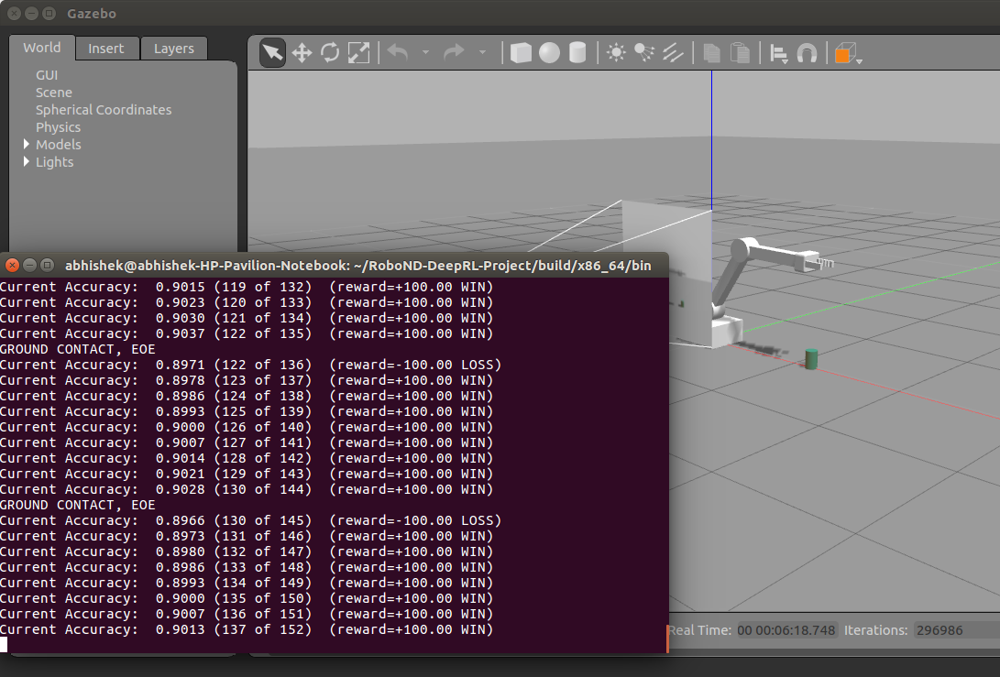
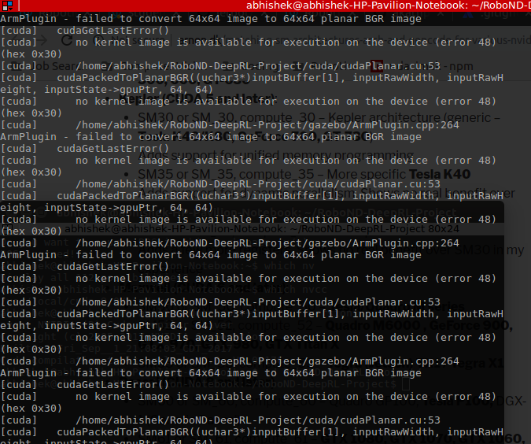

# RoboND Deep RL project
### Abhishek Kathpal

## Introduction

The goal of this project is to create a DQN agent and define reward functions to teach a robotic
arm to carry out two primary objectives. The gazebo world for this project is shown in Fig.
below.
1. Have any part of the arm touch the object of interest, with at least a **90%** accuracy.
2. Have only the gripper base of the robot arm touch the object with an accuracy of at least **80%**.

For implementing the above goal, Nvidia Jetson-reinforcement API is used. It is described in detail in next section. DQN network includes the implementation of LSTM Architecture. The various hyperparameters for the deep learning network are tunes properly to achieve the results. Analysis for choosing different parameters are shown in Result section. ROS is used to interface with the gazebo simulated environment. The feed from camera topic is fed into the neural network and then appropriate action is selected. Reward function is selected according to the task you want to achieve.

## Implementation Approach 
The implementation of the above approach to accomplish the task of training an RL agent to
reach the unknown object in environment space based on just raw pixel data is divided into
following steps-

1. **Subscribe to camera and collision topics**
The first step is to subscribe to the topics corresponding to camera and collision
detection. 

2. **Creating DQN Agent**
Deep Q-Network Agent has been defined in DQN.py python file using Pytorch. It uses both experience replay and fixed Q-Targets to converse as early as possible. I have
experimented with using LSTM Architecture as explained in the approach. It helps to converge earlier and achieved better results.

3. **Control of arm joints**
DQN action is mapped to a particular output for controlling each joint of robotic arm.
Two approaches can be used to update the state of agent. These approaches are
described below-
• Velocity Control – The current value for a joint’s velocity is stored in the
array vel with the array lengths based on the number of degrees of freedom
for the arm. 
• Position Control – The current value for a joint’s position is stored in the
array ref with the array lengths based on the number of degrees of freedom
for the arm. 

The number of actions defined in DQN.py is 3 and two outputs for each action either
increase or decrease in the joint angles.

4. **Assign Reward Functions**
Different reward functions are described in detail below.

## Reward Function

The next step is to issue rewards to the agent based on the required gaols. The various rewards used in this project is given below –

1. **Reward for gripper hitting the ground**

For this reward, we will extract a bounding box for gripper. As the arm moves only in one direction. So, the minimum and maximum value in z-direction are extracted and then the value is checked if it is close to 0 or not. If it close to zero, then end of episode flag is set to true. A negative reward of -1000 is assigned for hitting the ground.

2. **Interim reward based on distance to the object**

The reward is assigned on distance between two bounding boxes associated with
object and the arm. The reward function for this can be calculated as –
average delta = (average delta * alpha) + (dist * (1 - alpha))
It is a smooth moving average of the delta of the distance to the goal.

3. **Reward based on collision between arm and the object**

Collisions can be checked in the callback functions of the subscribers. Check condition
was defined to compare if the links of the manipulator arm is colliding with the object.
The collision elements are defined in the gazebo-world.

4. **Reward based on collision between the arm’s gripper base and the object**

For achieving the second objective, the above reward function is modified to make sure that only gripper base collide with the object.
Some of reward parameters that are tuned to get the desired output are as follows:

**REWARD_WIN** : +100 is given when arm or gripper touches the object

**REWARD_LOSS** : -100 is given as penalty when arm or gripper fails to touch the object

**REWARD_MULT** : It is a multiplier used to give interim reward. This parameter is selected to be 50. It affects the reward by multiplying the reward with the average distance.

* **alpha** :  It is a smoothing factor that relates to the average distance beteen the arm and object. It was set to be 0.8.

## Hyper-parameters

I have tuned the following parameters to achieve the desired results from this DQN agent.

* **OPTIMIZER** : **RMSprop** was used as this is mostly used in Recurrent Neural Networks. Adam can also be used as it has all the advantages of RMSProp

* **LEARNING_RATE** :  After many experiments **0.2** is set to achieve the accuracy for task1 and **0.02** for task2. Task 1 higher learning rate helps to converge the network faster. For task2, less learning rate helps as task2 is little complicated than task1.

* **REPLAY_MEMORY** : It was selected to be **10000** and thus it is possible to store REPLAY_MEMORY/Batch_SIZE. If the arm or task is much more complicated , then increasing this to 20000 or higher might help to learn the task properly.

* **BATCH_SIZE** : Batch size is set to **32**. I have experimented with different batch sizes from 32-128. As you increase the batch size, you need to increase the replay memory to get that desired accuracy. 

* **USE_LSTM** : It was **enabled** and this allows training the network by taking past frames into consideration. This will much improve the accuracy of learning. 

* **LSTM_SIZE** : It was kept at its default value at **256**. Increasing the size of LSTM cell will require more computing power. 

## Results

The task is achieved by tuning of various hyperparameters. I tried using velocity control, but the
results were not good. It takes a longer time to train in comparison to position control and position
control is quite simpler. I also tried varying the rewards to get better results. Setting the appropriate REWARD_MULTIPLIER is essential to converge and get the desired results. End of episode is set to true after the arm touches the ground.

**Videos are included in the Results folder for both the tasks**

### >90% accuracy for Robotic Arm touching the object

  

### >80% accuracy for Robotic Arm Gripper touching the object

  

## Problems
I have faced one error as I was running on my local system.

  

For resolving this error, I configured the cuda settings in CMakeLists

-gencode arch=compute_50,code=sm_50
-gencode arch=compute_52,code=sm_52
-gencode=arch=compute_52,code=compute_52
-gencode arch=compute_53,code=sm_53
-gencode arch=compute_60,code=sm_60
-gencode arch=compute_61,code=sm_61
-gencode arch=compute_62,code=sm_62
-gencode=arch=compute_61,code=compute_61
-gencode arch=compute_70,code=sm_70

## Future Work

After completing the main objectives of the task, I was able to make a robotic arm touch an
object in an environment based on raw pixel data. So far, the object is placed in only one of
the axes of the world coordinates at fixed location. In the future work, the randomization of
the object can be considered. The object will suppose to appear in the frame randomly at
other locations.
Along with that, it would be interesting to solve the issue when the arm must reach the object
in some other direction by using one more DOF. In this project, we can rotate the base of the
robotic arm to reach in to all the axes.
As this project is based on Jetson libraries, the next goal would be to implement it on real
robot. I think it should not be much difficult as I am already using ROS and gazebo for my
simulation, porting it to a 3DOF freedom arm would be possible without making any changes
to the implementation except you have to incorporate the data from actual sensors instead
of simulated ones.
The DQN agent that we've been using is discrete, meaning that the network selects one
output neuron per timestep, that the user then explicitly maps or defines to correspond to an
action (typically increasing/decreasing a position or velocity by a delta amount). This means
that for each degree of freedom in the robot, 2 outputs are required - one to increase the
variable by the delta and another to decrease it.
Another approach for improving the results is to use a DQN agent which is not discrete. Right
now, the network selects one output per time step and then we map the corresponding
output to a particular action. In most of real world scenarios, it is useful to control all DOFs of
robot simultaneously and have the network output the precise value of these variables.

## References
1. Riedmiller, Martin. "Neural fitted Q iteration–first experiences with a data efficient neural reinforcement learning method." European Conference on Machine Learning.
Springer, Berlin, Heidelberg, 2005.
2. Mnih, Volodymyr, et al. "Human-level control through deep reinforcement learning." Nature518.7540 (2015): 529 .
3. Udacity Robotics Software Nanodegree Program: Deep-RL technique explanations.
4. Deep reinforcement learning GPU libraries for NVIDIA Jetson with PyTorch, OpenAI Gym, and Gazebo robotics simulator.
5. He, K., Zhang, X., Ren, S., & Sun, J. (2016). Deep residual learning for image recognition. In Proceedings of the IEEE conference on computer vision and pattern recognition (pp. 770-778).

